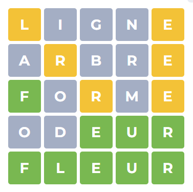

# Dojo Wordle - Le mot

## Le jeu



> "Wordle" est un jeu de mots en ligne dans lequel les joueurs ont pour objectif de deviner un mot de cinq lettres en six tentatives ou moins. À chaque tentative, le jeu donne un retour visuel sur les lettres choisies : une lettre en vert signifie qu'elle est à la bonne place, une lettre en jaune signifie qu'elle est présente dans le mot mais pas à la bonne place, et une lettre en gris signifie qu'elle n'est pas dans le mot. Grâce à ces indices, le joueur affine ses choix jusqu'à trouver le mot ou épuiser ses tentatives. *ChatGPT*

[Lien vers l'application web](https://wordle.louan.me/)

## Setup de l'application

Pour installer les dépendances et lancer l'application, exécutez les commandes suivantes dans votre terminal

```
cd dojoWordle
yarn
yarn start
```

Puis suivez les instructions données.
